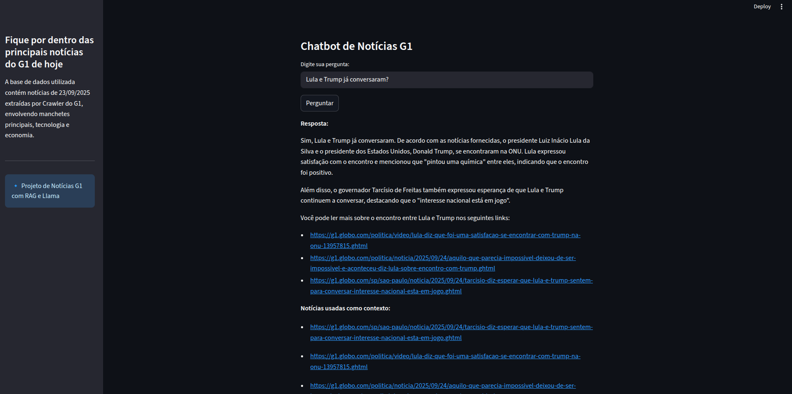

# Chatbot de Notícias G1 com RAG e Llama

## Problema a ser solucionado

Na realidade atual em que temos milhares de notícias todos os dias, se torna difícil acompanhar as notícias que realmente nos interessam. Pensando nisso, idealizamos o Chatbot de notícias do G1, que **automatiza a coleta de notícias do G1**, gera **embeddings semânticos das notícias** e cria um **chatbot inteligente** capaz de:

1. Responder perguntas dos usuários com base nas notícias.
2. Citar as fontes das informações.

Em resumo, o projeto resolve o problema de **filtrar, organizar e consultar notícias de forma eficiente**, tornando a informação mais acessível e prática para o usuário final.

## Tecnologias utilizadas

Este projeto cria um **chatbot de notícias do G1** utilizando **RAG (Retrieval-Augmented Generation)** com embeddings, **Pinecone** para armazenamento vetorial e **Llama** da Groq (llama-3.3-70b-versatile) como modelo de linguagem. O **Streamlit** é usado para a interface web interativa.

## Autores: 
- Gabriel Cardoso;
- Gisele Oliveira;
- Mayara Chew;
- Thaisa Guio;
- Victor Resende.

---

## 🔹 Funcionalidades

- **Crawler de notícias do G1**: coleta títulos, links e texto completo das notícias.
- **Geração de embeddings**: usando llama-text-embed-v2 para armazenar vetores no Pinecone.
- **RAG (Retrieval-Augmented Generation)**: responde perguntas dos usuários com base nas notícias coletadas.
- **Interface Streamlit**: permite selecionar seções, digitar perguntas e receber respostas contextualizadas.

---

## 🔹 Estrutura do Projeto
chatbot_g1/
│
├── app_streamlit.py # Interface principal do Streamlit
├── crawler_noticias_g1.py # Crawler para coletar notícias do G1
├── database/
│ └── noticias_g1.json # Base de notícias coletadas
├── environment.yml # Dependências para Conda
└── README.md

---

## 🔹 Requisitos

- Python 3.13
- Chaves de API:
  - **Groq** (para Llama)
  - **Pinecone** (armazenamento de embeddings)

---

## 🔹 Instalação com Conda

Crie o environment python com base nos requisitos do arquivo `environment.yml`.

---

## 🔹 Configuração de APIs

Adicione as suas chaves `GROQ_API_KEY` e `PINECONE_API_KEY` em `/.streamlit/secrets.toml`

---

## 🔹 Executando o projeto

- Crawler
python crawler_noticias_g1.py

- Chatbot
streamlit run app_streamlit.py

---

## 🔹 Observações

O crawler pode falhar se o G1 alterar a estrutura HTML. Ajuste os seletores CSS conforme necessário.
